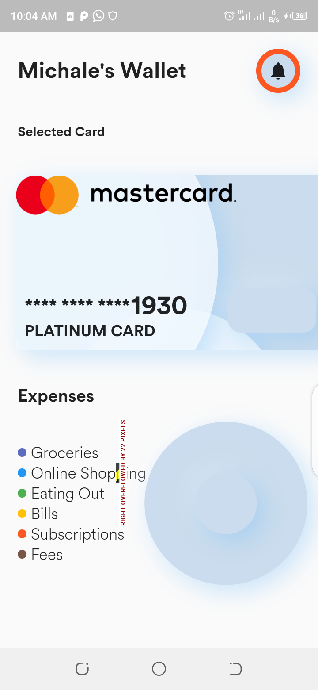
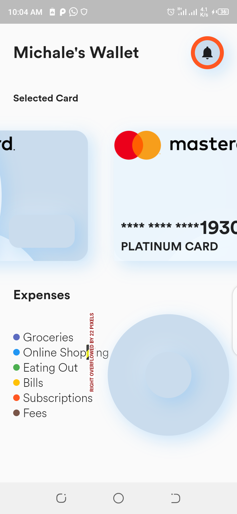

<h1>MOBILE WALLET</h1>

This is a mobile application written in flutter. This is a template that manages a user finanaces and monitors user spending on each of the available cards

<h4>Home page1</h4> 
  
<h4>Home page2</h4> 
 